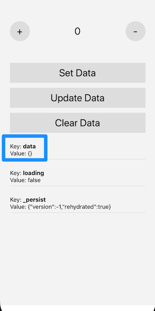
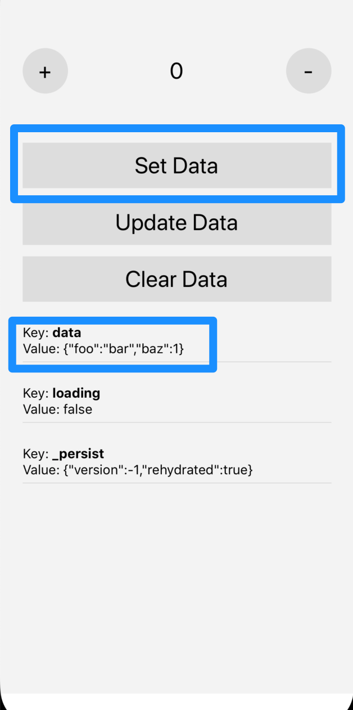
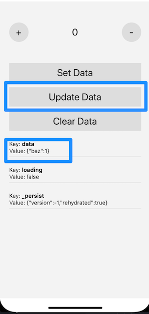
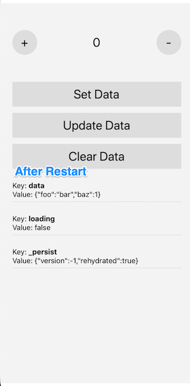

# RNReduxPersist: Bug with JS delete operator

Issue: https://github.com/rt2zz/redux-persist/issues/740

Initial State:

Set Data:

Update Data:

Even though it looks like the state updated (from the last screenshot), when you restart the app - the old state persists.

